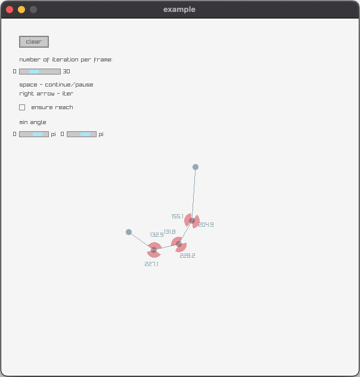

# c_fabrik

This is a FABRIK implementation in C.
It supports limiting angles.



## Compiling the library:

Run in root directory:

```
make RELEASE=1
```

The output should be `out/release/libfabrik.a`.

## Running the example:

Run in root directory:

```
make RELEASE=1
cd example
make RELEASE=1
out/release/example
```
